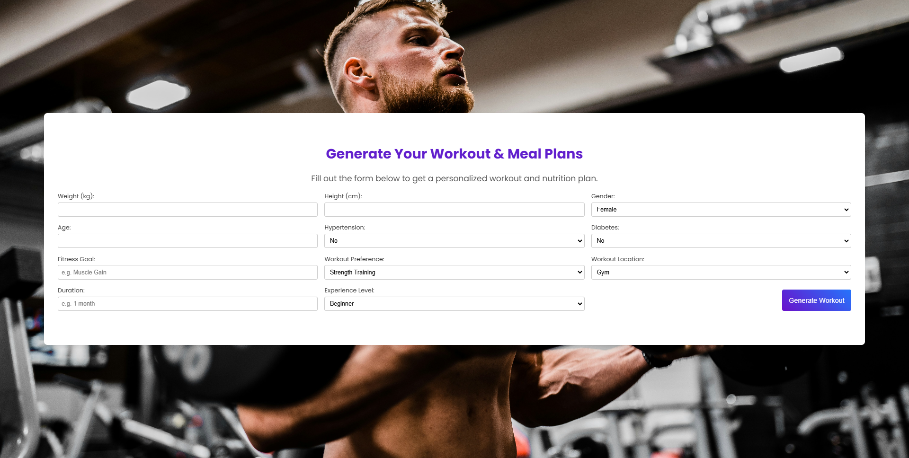

## ✨ Features

- 🤖 **AI Fitness Coach**: Real-time personalized fitness guidance using OpenAI
- 🔐 **User Authentication**: Secure login/signup system
- 📊 **BMI Calculator**: Calculate and track your Body Mass Index
- 💪 **Workout Plans**: Personalized exercise recommendations
- 📱 **Responsive Design**: Seamless experience across all devices
- 🎯 **Goal Tracking**: Monitor your fitness progress

## 🛠️ Tech Stack

- **Frontend**: React.js, CSS3
- **Backend**: Python(uvicorn, Fast API)
- **AI Integration**: OpenAI API

## 📸 Screenshots

<table>
  <tr>
    <td>Home Page</td>
    <td>AI Chat Interface</td>
  </tr>
  <tr>
    <td></td>
    <td></td>
  </tr>
</table>

## 🚀 Installation and Setup

1. Clone the repository
